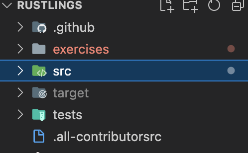
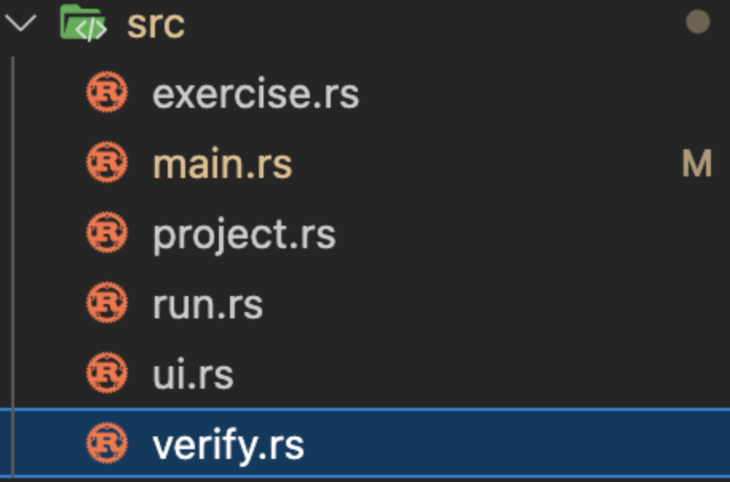
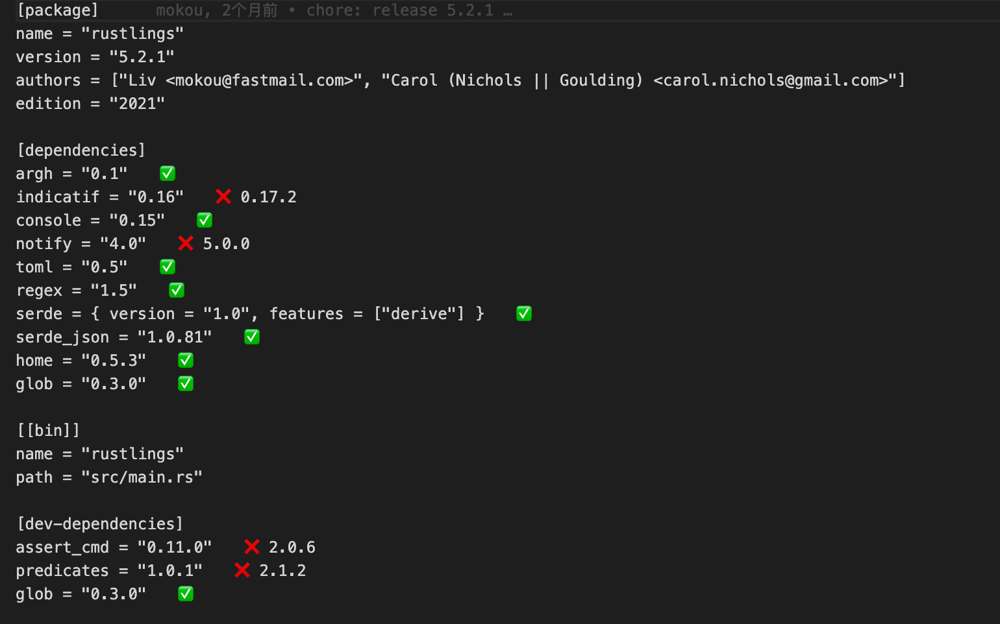
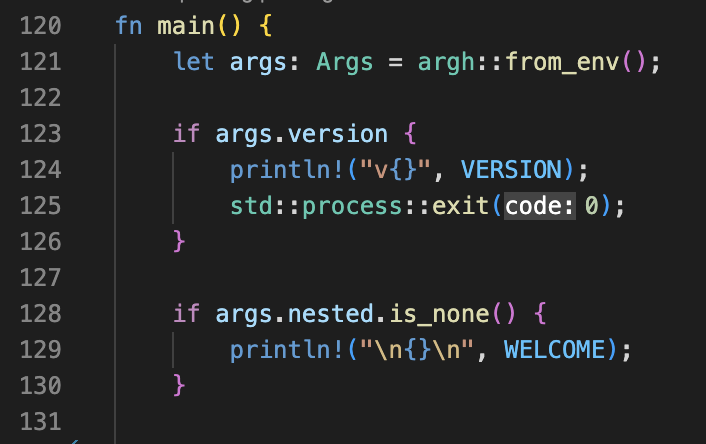
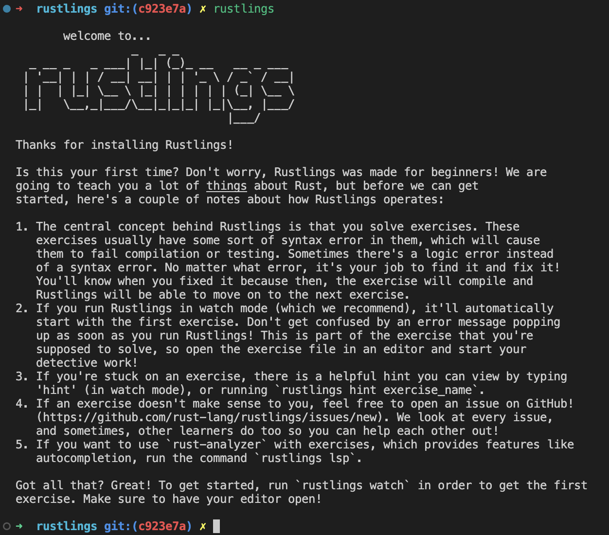
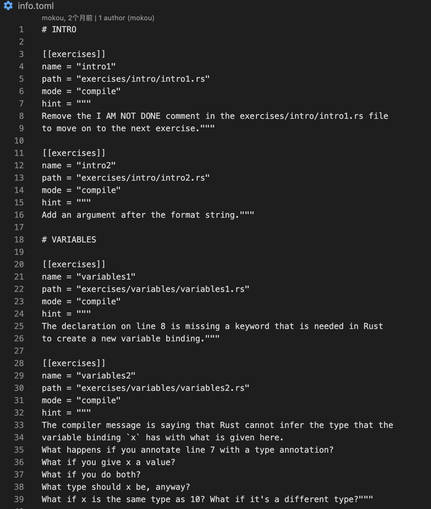
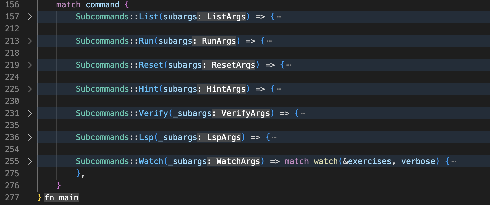

# rustlings源码分析

参与了《2022 年开源操作系统训练营》，里面有一个rustlings rust学习工具，觉得其运作方式有点意思，遂分析一下其实现。

## 架构

如下图所示，rustlins源码里面主要包含了三部分，exercises，src，tests，其中exercises里面包含了所有的练习题，src里面则是`rustlings`命令行的源码，tests顾名思义是一些测试。


因此，我们这次的分析目标主要在src目录里面


### 入口

按照惯例，我们先看看`Cargo.toml`里面的内容：

分别是这个项目的一些信息，一些依赖，然后生成的二进制文件及其入口路径，最后是dev环境的依赖。
我们很轻易的从toml文件里面找到了`rustlings`程序的入口。

### main

来到`main.rs`里面，找到main函数：

最开始的几行，可以从`from_env`函数看出来，是在获取命令行参数，因此，121行，我们就获取到了当前的命令行参数，并将其放入到args变量中。args变量的类型为Args，内部结构如下：

```rust
#[derive(FromArgs, PartialEq, Debug)]
/// Rustlings is a collection of small exercises to get you used to writing and reading Rust code
struct Args {
    /// show outputs from the test exercises
    #[argh(switch)]
    nocapture: bool,//是否打印输出
    /// show the executable version
    #[argh(switch, short = 'v')]
    version: bool,//是否显示版本
    #[argh(subcommand)]
    nested: Option<Subcommands>,//子命令
}
```

结合上面128行的代码，可以看出来，我们如果只输入`rustlings`这一个命令，那么输出将会打印欢迎语句，也即下面的语句：

```rust
const WELCOME: &str = r#"       welcome to...
                 _   _ _
  _ __ _   _ ___| |_| (_)_ __   __ _ ___
 | '__| | | / __| __| | | '_ \ / _` / __|
 | |  | |_| \__ \ |_| | | | | | (_| \__ \
 |_|   \__,_|___/\__|_|_|_| |_|\__, |___/
                               |___/"#;
```

让我们验证一下，在命令行输入`rustlings`：


😯为啥多了一大串内容，别着急，我们继续往下：

```rust
    if !Path::new("info.toml").exists() { //检测是否在rustlings目录内
        println!(
            "{} must be run from the rustlings directory",
            std::env::current_exe().unwrap().to_str().unwrap()
        );
        println!("Try `cd rustlings/`!");
        std::process::exit(1);
    }

    if !rustc_exists() { //检测安装了rust没有
        println!("We cannot find `rustc`.");
        println!("Try running `rustc --version` to diagnose your problem.");
        println!("For instructions on how to install Rust, check the README.");
        std::process::exit(1);
    }
```

上面这段代码首先判断了`info.toml`文件是否存在，如果不存在就要求进入到`rustlings`目录；然后判断是否安装了rust。

针对于上面的步骤，我们为啥要去判断`info.toml`文件是否存在呢？打开文件，我截取了一段内容：

我们可以很清楚的看到，里面包含了每个习题的名字，路径，模式，提示。这也许能在后面解决一些我们的疑问🤔️。

继续向下看：

```rust
    let toml_str = &fs::read_to_string("info.toml").unwrap();
    let exercises = toml::from_str::<ExerciseList>(toml_str).unwrap().exercises;//解析出所有习题
    let verbose = args.nocapture;//是否显示输出

    let command = args.nested.unwrap_or_else(|| {//解析子命令
        println!("{}\n", DEFAULT_OUT);
        std::process::exit(0);
    });
```

我们从`info.toml`中获取到所有的习题，然后解析子命令，如果失败，则会打印默认输出，然后退出，这就跟上面我们说的，只输入`rustlings`，打印了一大串内容对上了😄。

继续向下看，找到了一个match语句，里面的匹配语句我们好像在rustlings仓库的readme看到过：


让我们把rustlings的帮助输出打印出来：


经过对比，我们可以很清晰的看到它们两者的对应关系，因此，下面让我们挨个分析吧。

### rustlings list

直接上代码：

```rust
       Subcommands::List(subargs) => {
            if !subargs.paths && !subargs.names {
                println!("{:<17}\t{:<46}\t{:<7}", "Name", "Path", "Status");
            }
            let mut exercises_done: u16 = 0;
            let filters = subargs.filter.clone().unwrap_or_default().to_lowercase();//匹配项
            exercises.iter().for_each(|e| {
                let fname = format!("{}", e.path.display());
                let filter_cond = filters//检测在路径或者名字中存在关键字的题
                    .split(',')
                    .filter(|f| !f.trim().is_empty())
                    .any(|f| e.name.contains(&f) || fname.contains(&f));
                let status = if e.looks_done() {//获取状态
                    exercises_done += 1;
                    "Done"
                } else {
                    "Pending"
                };
                let solve_cond = {
                    (e.looks_done() && subargs.solved)
                        || (!e.looks_done() && subargs.unsolved)
                        || (!subargs.solved && !subargs.unsolved)
                };
                if solve_cond && (filter_cond || subargs.filter.is_none()) {
                    let line = if subargs.paths {
                        format!("{}\n", fname)
                    } else if subargs.names {
                        format!("{}\n", e.name)
                    } else {
                        format!("{:<17}\t{:<46}\t{:<7}\n", e.name, fname, status)
                    };
                    // Somehow using println! leads to the binary panicking
                    // when its output is piped.
                    // So, we're handling a Broken Pipe error and exiting with 0 anyway
                    let stdout = std::io::stdout(); //打印
                    {
                        let mut handle = stdout.lock();
                        handle.write_all(line.as_bytes()).unwrap_or_else(|e| {
                            match e.kind() {
                                std::io::ErrorKind::BrokenPipe => std::process::exit(0),
                                _ => std::process::exit(1),
                            };
                        });
                    }
                }
            });
            let percentage_progress = exercises_done as f32 / exercises.len() as f32 * 100.0;
            println!(
                "Progress: You completed {} / {} exercises ({:.2} %).",
                exercises_done,
                exercises.len(),
                percentage_progress
            );
            std::process::exit(0);
        }
```

这个的流程并不难，首先从子命令中解析出带的命令行参数，然后将练习题挨个读取并按照规则处理，最后将打印出输出。

### rustlings reset

reset也是比较简单，就只是简单的调用一下`git stash`命令将指定的文件的更改stash起来。

```rust
// Resets the exercise by stashing the changes.
pub fn reset(exercise: &Exercise) -> Result<(), ()> {
    let command = Command::new("git")
        .args(["stash", "--"])
        .arg(&exercise.path)
        .spawn();

    match command {
        Ok(_) => Ok(()),
        Err(_) => Err(()),
    }
}
```

### rustlings hint

hint就更简单了，简单的将`info.toml`里面的hint内容打印出来：

```rust
    Subcommands::Hint(subargs) => {
        let exercise = find_exercise(&subargs.name, &exercises);

        println!("{}", exercise.hint);
    }   
```

### rustlings lsp

lsp命令，主要将各个crate的文件分开来，并在最后写入到`rust-project.json`文件里面（至于为啥能被rust-analysis识别到，这个有兴趣的话，自己探究下）。

```rust
    Subcommands::Lsp(_subargs) => {
        let mut project = RustAnalyzerProject::new();
        project
            .get_sysroot_src()
            .expect("Couldn't find toolchain path, do you have `rustc` installed?");
        project
            .exercies_to_json()
            .expect("Couldn't parse rustlings exercises files");

        if project.crates.is_empty() {
            println!("Failed find any exercises, make sure you're in the `rustlings` folder");
        } else if project.write_to_disk().is_err() {
            println!("Failed to write rust-project.json to disk for rust-analyzer");
        } else {
            println!("Successfully generated rust-project.json");
            println!("rust-analyzer will now parse exercises, restart your language server or editor")
        }
    }
```

### rustlings verify

```rust
    Subcommands::Verify(_subargs) => {
        verify(&exercises, (0, exercises.len()), verbose)
            .unwrap_or_else(|_| std::process::exit(1));
    }
```
上面调用verify函数去处理整个习题集的验证问题，让我们看看verify函数的定义：

```rust
    // Verify that the provided container of Exercise objects
    // can be compiled and run without any failures.
    // Any such failures will be reported to the end user.
    // If the Exercise being verified is a test, the verbose boolean
    // determines whether or not the test harness outputs are displayed.
    pub fn verify<'a>(
        exercises: impl IntoIterator<Item = &'a Exercise>,
        progress: (usize, usize),
        verbose: bool,
    ) -> Result<(), &'a Exercise> {
        let (num_done, total) = progress;
        let bar = ProgressBar::new(total as u64);
        bar.set_style(ProgressStyle::default_bar()
            .template("Progress: [{bar:60.green/red}] {pos}/{len}")
            .progress_chars("#>-")
        );
        bar.set_position(num_done as u64);
        for exercise in exercises {
            let compile_result = match exercise.mode {
                Mode::Test => compile_and_test(exercise, RunMode::Interactive, verbose),
                Mode::Compile => compile_and_run_interactively(exercise),
                Mode::Clippy => compile_only(exercise),
            };
            if !compile_result.unwrap_or(false) {
                return Err(exercise);
            }
            bar.inc(1);
        }
        Ok(())
    }
```

代码相当清晰，就是创建一个进度条，然后循环整个习题集，根据题目的mode，调用不同的分支进行处理：
比如：
test => 调用compile_and_test，
compile => 调用compile_and_run_interactively，
clippy => 调用compile_only

根据这些不同的分支的出来的信息，然后最终将其呈现在终端里面。

### rustlings run

它的代码倒是很少：

```rust
    Subcommands::Run(subargs) => {
        let exercise = find_exercise(&subargs.name, &exercises);

        run(exercise, verbose).unwrap_or_else(|_| std::process::exit(1));
    }
```

首先根据子命令的参数，找到相应的练习题，然后运行练习题的代码。

```rust
// Invoke the rust compiler on the path of the given exercise,
// and run the ensuing binary.
// The verbose argument helps determine whether or not to show
// the output from the test harnesses (if the mode of the exercise is test)
pub fn run(exercise: &Exercise, verbose: bool) -> Result<(), ()> {
    match exercise.mode {
        Mode::Test => test(exercise, verbose)?,
        Mode::Compile => compile_and_run(exercise)?,
        Mode::Clippy => compile_and_run(exercise)?,
    }
    Ok(())
}
```

同样h是根据练习题的mode，来运行不同的分支。

### rustlings watch

```rust
    Subcommands::Watch(_subargs) => match watch(&exercises, verbose) {
        Err(e) => {
            println!(
                "Error: Could not watch your progress. Error message was {:?}.",
                e
            );
            println!("Most likely you've run out of disk space or your 'inotify limit' has been reached.");
            std::process::exit(1);
        }
        Ok(WatchStatus::Finished) => {
            println!(
                "{emoji} All exercises completed! {emoji}",
                emoji = Emoji("🎉", "★")
            );
            println!("\n{}\n", FENISH_LINE);
        }
        Ok(WatchStatus::Unfinished) => {
            println!("We hope you're enjoying learning about Rust!");
            println!("If you want to continue working on the exercises at a later point, you can simply run `rustlings watch` again");
        }
    },
```

根据watch函数返回的结果，分别打印不同的输出。
```rust
    fn watch(exercises: &[Exercise], verbose: bool) -> notify::Result<WatchStatus> {
        /* Clears the terminal with an ANSI escape code.
        Works in UNIX and newer Windows terminals. */
        fn clear_screen() {
            println!("\x1Bc");
        }

        let (tx, rx) = channel();
        let should_quit = Arc::new(AtomicBool::new(false));

        let mut watcher: RecommendedWatcher = Watcher::new(tx, Duration::from_secs(2))?;
        watcher.watch(Path::new("./exercises"), RecursiveMode::Recursive)?;

        clear_screen();

        let to_owned_hint = |t: &Exercise| t.hint.to_owned();
        let failed_exercise_hint = match verify(exercises.iter(), (0, exercises.len()), verbose) {
            Ok(_) => return Ok(WatchStatus::Finished),
            Err(exercise) => Arc::new(Mutex::new(Some(to_owned_hint(exercise)))),
        };
        spawn_watch_shell(&failed_exercise_hint, Arc::clone(&should_quit));
        loop {
            match rx.recv_timeout(Duration::from_secs(1)) {
                Ok(event) => match event {
                    DebouncedEvent::Create(b) | DebouncedEvent::Chmod(b) | DebouncedEvent::Write(b) => {
                        if b.extension() == Some(OsStr::new("rs")) && b.exists() {
                            let filepath = b.as_path().canonicalize().unwrap();
                            let pending_exercises = exercises
                                .iter()
                                .find(|e| filepath.ends_with(&e.path))
                                .into_iter()
                                .chain(
                                    exercises
                                        .iter()
                                        .filter(|e| !e.looks_done() && !filepath.ends_with(&e.path)),
                                );
                            let num_done = exercises.iter().filter(|e| e.looks_done()).count();
                            clear_screen();
                            match verify(pending_exercises, (num_done, exercises.len()), verbose) {
                                Ok(_) => return Ok(WatchStatus::Finished),
                                Err(exercise) => {
                                    let mut failed_exercise_hint = failed_exercise_hint.lock().unwrap();
                                    *failed_exercise_hint = Some(to_owned_hint(exercise));
                                }
                            }
                        }
                    }
                    _ => {}
                },
                Err(RecvTimeoutError::Timeout) => {
                    // the timeout expired, just check the `should_quit` variable below then loop again
                }
                Err(e) => println!("watch error: {:?}", e),
            }
            // Check if we need to exit
            if should_quit.load(Ordering::SeqCst) {
                return Ok(WatchStatus::Unfinished);
            }
        }
    }
```

流程：
1、创建一个通道，用来接收文本变化通知；然后监视exercises文件夹中的文件，每2s检测一次，看是否发生了变化，如有变化则发送到通道；
2、验证练习，直到遇到错误（全部正确则直接返回了Finished）；在终端上面接收输入，以响应相应的输出（例如：hint显示题目hint）；
3、无条件循环，接收从通道传来的值（变更，超时，错误），当接收到变更信息时，扫描全部未完成的题目，并再次进行verify，并根据结果进行处理。

这里可能有朋友觉得，这个return不就退出match函数了么？那么为什么我的是告诉我下一题的问题呢？
🙆‍♂️好问题，这个问题出现的原因是因为上面的verify函数，大家可以看看，verify函数只有在所有题目全部正确之后才会返回ok。这就是为什么显示了下一题的原因。

### 编译执行

大家可能发现上面我都只是说到了关于命令行的逻辑，而没有深入执行、编译、测试的逻辑，这是为什么？

很简单，我们自己运行rust程序是直接cargo run， 那么cargo run实际上也需要先编译程序，才能运行程序，`rustlings里面采用了rustc进行编译程序，并将其结果放入到一个唯一的tmp文件里面，然后执行这个tmp文件.只不过对于mode不同的，编译的时候的参数不一样而已！！！`。

## 结语

rustlings 给我们带来了一个关于rust学习的美好旅程，而我们应该学以致用，反过来看看它的思路，从而不会陷入到rust“入门再入门”魔咒中。我是tanqiangyes，一个区块链从业者，go和rust学习者，下篇文章见。
